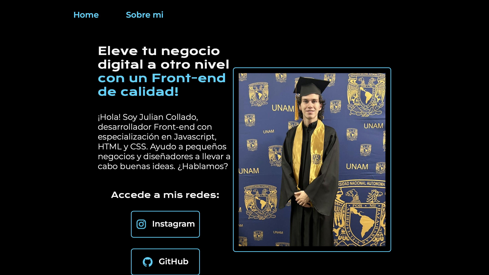
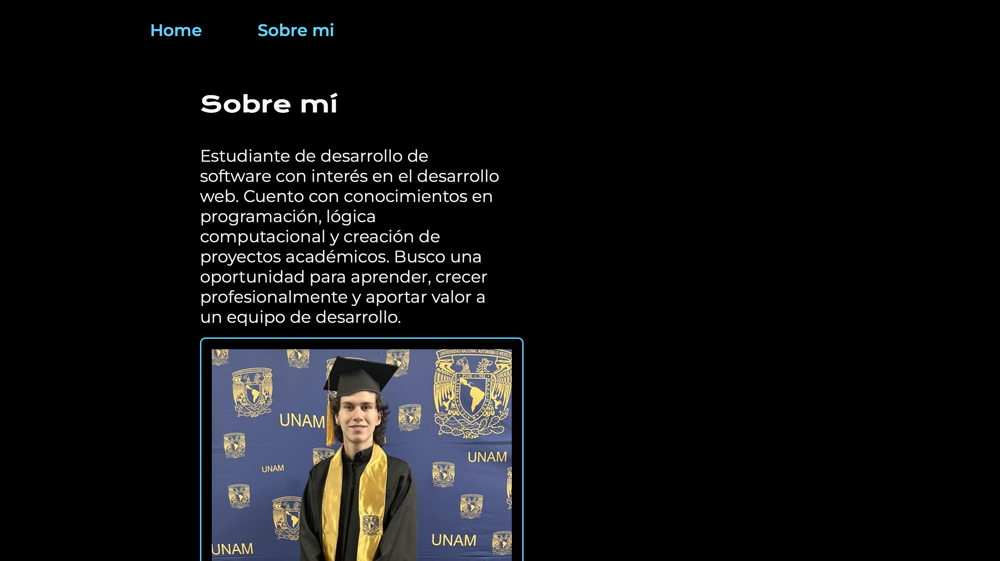

# Portafolio Personal - Desarrollador Front-end

## Descripción
Sitio web personal de portafolio desarrollado con HTML5 y CSS3 puro. Proyecto enfocado en demostrar habilidades de maquetación web moderna, diseño responsivo y buenas prácticas de desarrollo front-end. Incluye una página principal de presentación y una sección "Sobre mí".

## Objetivo del Proyecto
Aplicar conocimientos fundamentales de desarrollo web:
- Estructura semántica con HTML5
- Estilizado avanzado con CSS3
- Diseño responsivo con media queries
- Uso de variables CSS (custom properties)
- Navegación multi-página
- Optimización de imágenes y assets

## Tecnologías Utilizadas
- **HTML5**: Etiquetas semánticas (`<header>`, `<main>`, `<section>`, `<footer>`)
- **CSS3**: Flexbox, variables CSS, media queries, Google Fonts
- **Diseño Responsivo**: Adaptación a diferentes tamaños de pantalla

## Visualización

### Página Principal (Home)

*Landing page con presentación profesional, call-to-action y enlaces a redes sociales*

### Página "Sobre mí"

*Sección informativa con descripción profesional y experiencia académica*

---

## Estructura del Proyecto
```
ClaseHTMLCSS/
├── index.html          # Página principal
├── about.html          # Página "Sobre mí"
├── styles/
│   └── style.css       # Estilos globales del sitio
├── assets/             # Recursos gráficos
│   ├── foto-graduacion.png
│   ├── github.png
│   └── instagram.png
└── screenshots/        # Capturas del proyecto
```

---

## Análisis Técnico del Código

### 1. Variables CSS (Custom Properties)

```css
:root{
    --color-primario:#000000;
    --color-secundario:#F6F6F6;
    --color-terciario:#22D4FD;

    --fuente-montserrat:"Montserrat", sans-serif;
    --fuente-krona: "Krona One", sans-serif;
}
```

**Conceptos aplicados:**
- **Selector `:root`**: Define variables globales accesibles en todo el documento
- **Nomenclatura con `--`**: Convención de CSS para custom properties
- **Reutilización**: `var(--color-primario)` permite cambiar colores desde un solo lugar
- **Mantenibilidad**: Facilita ajustes de diseño y temas

**Ventajas:**
- Código DRY (Don't Repeat Yourself)
- Facilita cambios de tema/marca
- Mejora la legibilidad del código

---

### 2. Reset CSS y Box-Sizing

```css
* {
    padding: 0;
    margin: 0;
}

body{
    box-sizing: border-box;
}
```

**Conceptos aplicados:**
- **Selector universal `*`**: Aplica estilos a todos los elementos
- **Reset de márgenes**: Elimina espaciados por defecto del navegador
- **Box-sizing**: Control preciso del modelo de caja CSS

**Propósito:** Consistencia entre navegadores y control total del layout.

---

### 3. Navegación con Flexbox

```css
.header_menu{
    display: flex;
    gap: 80px;
}
```

**Conceptos aplicados:**
- **Flexbox**: Sistema de layout unidimensional
- **Propiedad `gap`**: Espaciado entre elementos flex (CSS moderno)
- **Alineación automática**: Sin necesidad de márgenes manuales

**HTML asociado:**
```html
<nav class="header_menu">
    <a class="header_menu_link" href="index.html">Home</a>
    <a class="header_menu_link" href="about.html">Sobre mi</a>
</nav>
```

---

### 4. Layout Principal con Flexbox

```css
.presentacion{
    padding: 5% 20%;
    display: flex;
    align-items: center;
    justify-content: space-between;
}
```

**Conceptos aplicados:**
- **`display: flex`**: Contenedor flexible
- **`align-items: center`**: Centrado vertical
- **`justify-content: space-between`**: Distribución horizontal con espacio máximo entre elementos
- **Padding porcentual**: Espaciado responsivo basado en viewport

**Resultado:** Layout de dos columnas (50% texto - 50% imagen) perfectamente alineado.

---

### 5. Tipografía y Google Fonts

```css
@import url('https://fonts.googleapis.com/css2?family=Krona+One&family=Montserrat:...');

.presentacion_contenido_titulo{
    font-size: 2rem;
    font-family: var(--fuente-krona);
}
```

**Conceptos aplicados:**
- **`@import`**: Carga de fuentes externas
- **Unidades `rem`**: Escalado relativo al root (accesibilidad)
- **Jerarquía tipográfica**: Krona One para títulos, Montserrat para texto

**Mejores prácticas:**
- Uso de fuentes web para consistencia
- Unidades relativas para responsive design
- Variables para fuentes facilitan cambios globales

---

### 6. Botones de Redes Sociales

```css
.presentacion_enlaces_link{
    width: 50%;
    text-align: center;
    padding: 21.5px 0;
    border-radius: 8px;
    border: 2px solid var(--color-terciario);
    display: flex;
    justify-content: center;
    gap: 16px;
}

.presentacion_enlaces_link:hover{
    background-color: #272727;
}
```

**Conceptos aplicados:**
- **Flexbox en enlaces**: Alineación perfecta de ícono + texto
- **Pseudo-clase `:hover`**: Feedback visual interactivo
- **Border-radius**: Esquinas redondeadas
- **Transiciones implícitas**: El navegador anima el cambio de color

**HTML asociado:**
```html
<a class="presentacion_enlaces_link" href="https://instagram.com/">
    
    Instagram
</a>
```

---

### 7. Diseño Responsivo

```css
@media (max-width: 1200px) {
    .header{
        padding: 10%;
    }

    .presentacion{
        flex-direction: column-reverse;
        padding: 5%;
    }

    .presentacion_contenido{
        width: auto;
    }
}
```

**Conceptos aplicados:**
- **Media Query**: Estilos condicionales según ancho de pantalla
- **Breakpoint en 1200px**: Cambio de desktop a tablet/móvil
- **`flex-direction: column-reverse`**: En móvil, imagen arriba, texto abajo
- **Width auto**: Contenido ocupa todo el ancho disponible

**Estrategia Mobile-First invertida:** Se diseñó primero para desktop, luego se adaptó a móvil.

---

### 8. Estructura Semántica HTML

```html
<header class="header">
    <nav class="header_menu">...</nav>
</header>

<main class="presentacion">
    <section class="presentacion_contenido">...</section>
</main>

<footer class="footer">...</footer>
```

**Conceptos aplicados:**
- **Etiquetas semánticas**: `<header>`, `<nav>`, `<main>`, `<section>`, `<footer>`
- **Accesibilidad**: Mejora navegación con lectores de pantalla
- **SEO**: Estructura clara para motores de búsqueda

**Ventajas:**
- Código más legible
- Mejor accesibilidad
- Optimización para SEO

---

## Características Destacadas

### 1. Sistema de Navegación
- **Menú de navegación consistente** en ambas páginas
- **Enlaces internos** (`index.html`, `about.html`)
- **Hover effects** para mejor UX

### 2. Diseño Visual
- **Esquema de color profesional**: Negro (#000000) con acentos cyan (#22D4FD)
- **Contraste óptimo**: Texto claro sobre fondo oscuro
- **Borde decorativo en imagen**: Frame con color terciario

### 3. Contenido Estructurado
```html
<h1>Título principal <strong class="Titulo-destacar">texto destacado</strong></h1>
```
- **Jerarquía visual**: Parte del título en color de acento
- **Tag `<strong>`**: Importancia semántica + estilizado

---

## Conceptos de CSS Dominados

### Layout y Posicionamiento
- **Flexbox completo**: Ejes principal y cruzado, justify-content, align-items
- **Gap property**: Espaciado moderno entre elementos flex
- **Padding porcentual**: Responsive spacing

### Diseño Responsivo
- **Media queries**: Breakpoints personalizados
- **Flex-direction**: Cambio de orientación del layout
- **Unidades relativas**: `rem`, `%` para escalabilidad

### Estilizado Avanzado
- **Variables CSS**: Tema centralizado
- **Pseudo-clases**: `:hover` para interactividad
- **Border-radius**: Esquinas redondeadas
- **Google Fonts**: Tipografía personalizada

### Buenas Prácticas
- **Reset CSS**: Normalización de estilos
- **Box-sizing**: Modelo de caja predecible
- **Nomenclatura BEM-like**: `.presentacion_contenido_titulo`
- **HTML semántico**: Etiquetas con significado

---

## Aprendizajes Clave

1. **Flexbox como sistema de layout principal**
   - Reemplaza floats y posicionamiento absoluto
   - Simplifica alineación vertical/horizontal
   - Base para layouts modernos

2. **Variables CSS para mantenibilidad**
   - Un solo lugar para modificar colores/fuentes
   - Facilita experimentación con diseño
   - Estándar en proyectos profesionales

3. **Diseño responsivo con media queries**
   - Adaptación a diferentes dispositivos
   - Cambios estructurales con flex-direction
   - Breakpoints estratégicos

4. **Separación de contenido y presentación**
   - HTML para estructura semántica
   - CSS para toda la presentación visual
   - Sin estilos inline

5. **Navegación multi-página**
   - Links relativos entre archivos HTML
   - Consistencia de header/footer
   - Experiencia de usuario fluida

6. **Nomenclatura de clases descriptiva**
   - `.presentacion_enlaces_link` = contexto_componente_tipo
   - Código autodocumentado
   - Escalabilidad para proyectos grandes

---

**Proyecto desarrollado como parte del curso de HTML y CSS - Alura**
