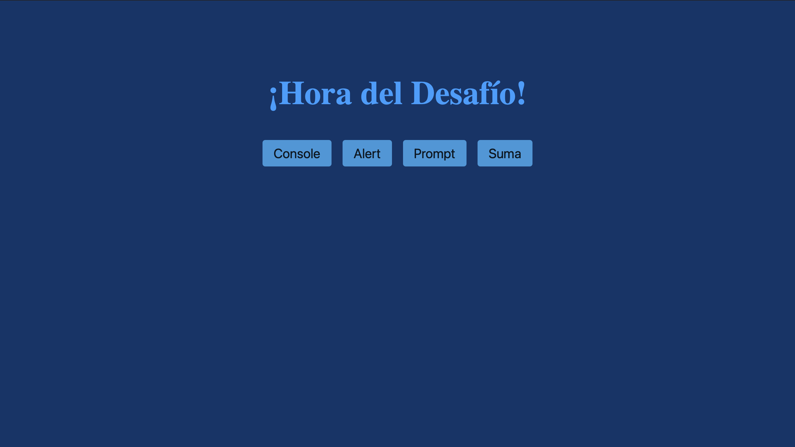

# Hora del Desafío - Interacción con el Usuario

## Descripción
Aplicación web interactiva que demuestra los diferentes métodos de comunicación entre JavaScript y el usuario. El proyecto implementa 4 funciones básicas utilizando `console.log()`, `alert()` y `prompt()` para mostrar el flujo de entrada/salida de datos en una aplicación web.

## Objetivo del Proyecto
Dominar los fundamentos de interacción usuario-navegador:
- Manipulación del DOM
- Eventos de click en botones
- Entrada de datos del usuario
- Salida de información en diferentes formatos
- Conversión de tipos de datos

## Tecnologías Utilizadas
- **HTML5**: Estructura semántica con botones interactivos
- **CSS3**: Diseño moderno con flexbox y efectos hover
- **JavaScript**: Manipulación del DOM y lógica de interacción

## Visualización

### Interfaz Principal

*Pantalla inicial con 4 botones interactivos que demuestran diferentes métodos de comunicación con el usuario*

---

## Funcionalidades Implementadas

### 1. Manipulación Dinámica del DOM
```javascript
let titulo = document.querySelector("h1");
titulo.innerHTML = "¡Hora del Desafío!";
```
**Conceptos aplicados:**
- Selección de elementos con `querySelector()`
- Modificación de contenido HTML con `.innerHTML`
- Asignación dinámica de texto

**Propósito:** El título se genera dinámicamente al cargar la página, demostrando que JavaScript puede modificar el HTML en tiempo de ejecución.

---

### 2. Console.log() - Depuración y Registro
```javascript
function funcionConsola(){
    console.log("El boton fue clickado");
}
```
**Conceptos aplicados:**
- Atributo `onclick` en HTML
- Función sin parámetros
- Salida a consola del navegador

**Propósito:** Introducción al debugging. El mensaje aparece en la consola del navegador (F12), método fundamental para desarrollo y detección de errores.

---

### 3. Alert() - Notificaciones al Usuario
```javascript
function funcionAlert(){
    alert("Yo amo JS");
}
```
**Conceptos aplicados:**
- Ventana modal de alerta
- Interrupción del flujo de la página
- Comunicación directa con el usuario

**Propósito:** Mostrar mensajes importantes que requieren reconocimiento del usuario antes de continuar.

---

### 4. Prompt() - Entrada de Datos Simple
```javascript
function funcionPrompt(){
    let ciudad = prompt("Dime el nombre de una ciudad de Brasil");
    alert(`Estuve en ${ciudad} y me acorde de ti`);
}
```
**Conceptos aplicados:**
- Captura de entrada del usuario con `prompt()`
- Almacenamiento en variable
- Template literals con interpolación (`` `${variable}` ``)
- Retroalimentación personalizada

**Flujo de ejecución:**
1. Se solicita al usuario ingresar una ciudad
2. El valor se almacena en la variable `ciudad`
3. Se muestra un mensaje personalizado usando el valor ingresado

---

### 5. Suma Interactiva - Conversión de Tipos
```javascript
function funcionSuma(){
    let n1 = parseInt(prompt("Dame el primer numero"));
    let n2 = parseInt(prompt("Dame el segundo numero"));
    resultado = n1 + n2;
    alert(`El resultado es ${resultado}`);
}
```
**Conceptos aplicados:**
- Conversión de string a número con `parseInt()`
- Múltiples entradas del usuario
- Operaciones aritméticas
- Variables locales
- Concatenación con template literals

**Flujo de ejecución:**
1. Solicita primer número (entrada como string)
2. Convierte a entero con `parseInt()`
3. Solicita segundo número y convierte
4. Realiza suma aritmética
5. Muestra resultado formateado

**Punto crítico:** Sin `parseInt()`, JavaScript concatenaría los strings (ej: "5" + "3" = "53") en lugar de sumarlos (5 + 3 = 8).

---

## Estructura del Proyecto
```
DesafioJS/
├── index.html      # Estructura HTML con 4 botones
├── style.css       # Estilos modernos con flexbox
├── app.js          # Lógica de interacción
└── screenshots/    # Capturas de pantalla
```

## Estilos Destacados

### Diseño Responsivo con Flexbox
```css
main, html {
  display: flex;
  justify-content: center;
  align-items: center;
  background-color: #0C356A;
}
```
**Conceptos aplicados:**
- Centrado vertical y horizontal con flexbox
- Fondo con esquema de color profesional

### Efectos Interactivos
```css
.button:hover {
  background-color: #2980b9;
}
```
**Concepto:** Feedback visual al pasar el mouse sobre los botones, mejorando la experiencia de usuario.

---

## Conceptos de Programación Implementados

### Manipulación del DOM
- **Selección de elementos**: `document.querySelector()`
- **Modificación de contenido**: `.innerHTML`
- **Eventos inline**: `onclick="nombreFuncion()"`

### Entrada/Salida
- **Salida a consola**: `console.log()` - debugging
- **Alerta modal**: `alert()` - notificaciones
- **Entrada de usuario**: `prompt()` - captura de datos

### Tipos de Datos
- **Strings**: Texto ingresado por el usuario
- **Números**: Conversión con `parseInt()`
- **Template literals**: Interpolación de variables con `` `${}` ``

### Funciones
- Declaración de funciones sin parámetros
- Funciones vinculadas a eventos de click
- Variables locales dentro de funciones

---

## Diferencia: prompt() vs input HTML

Este proyecto usa `prompt()` para educación inicial, pero es importante conocer:

### Prompt (usado aquí)
```javascript
let valor = prompt("Mensaje");
```
**Ventajas:**
- Simple y directo
- No requiere HTML adicional

**Desventajas:**
- Interfaz anticuada
- Bloquea toda la página
- No se puede estilizar
- Mala experiencia de usuario en producción

### Input HTML (método profesional)
```html
<input type="text" id="miInput">
```
```javascript
let valor = document.getElementById("miInput").value;
```
**Ventajas:**
- Totalmente personalizable
- No bloquea la interfaz
- Mejor UX
- Se usa en aplicaciones reales

**Razón pedagógica:** `prompt()` es ideal para aprender la lógica sin complejidad adicional de formularios HTML.

---

## Aprendizajes Clave

1. **Separación de capas**: HTML (estructura), CSS (presentación), JS (comportamiento)
2. **Eventos del DOM**: Vinculación de funciones JavaScript a eventos HTML
3. **Conversión de tipos**: Diferencia entre strings y números en JavaScript
4. **Template literals**: Forma moderna de concatenar strings y variables
5. **Debugging básico**: Uso de `console.log()` para verificar ejecución
6. **Interacción básica**: Fundamentos de captura y validación de datos

## Casos de Uso Educativos

| Función | Caso de Uso Real | Alternativa Profesional |
|---------|------------------|-------------------------|
| `console.log()` | Debugging de código | DevTools, Debugger |
| `alert()` | Confirmaciones críticas | Modales personalizados |
| `prompt()` | Prototipos rápidos | Formularios HTML5 |

---

**Proyecto desarrollado como parte del curso de Lógica de Programación con JavaScript - Alura**
